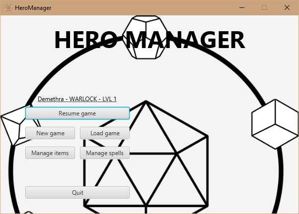
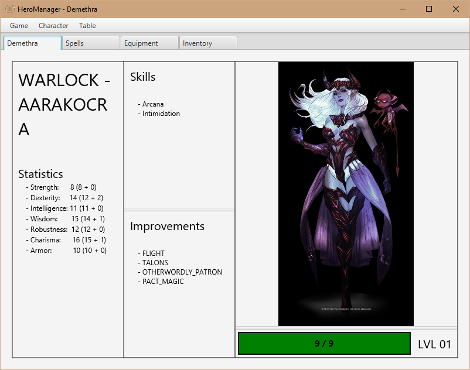
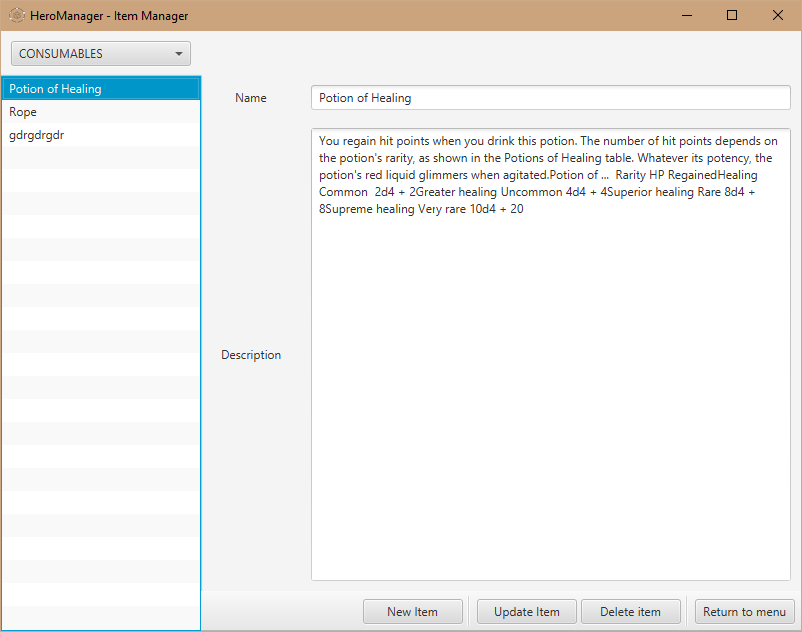
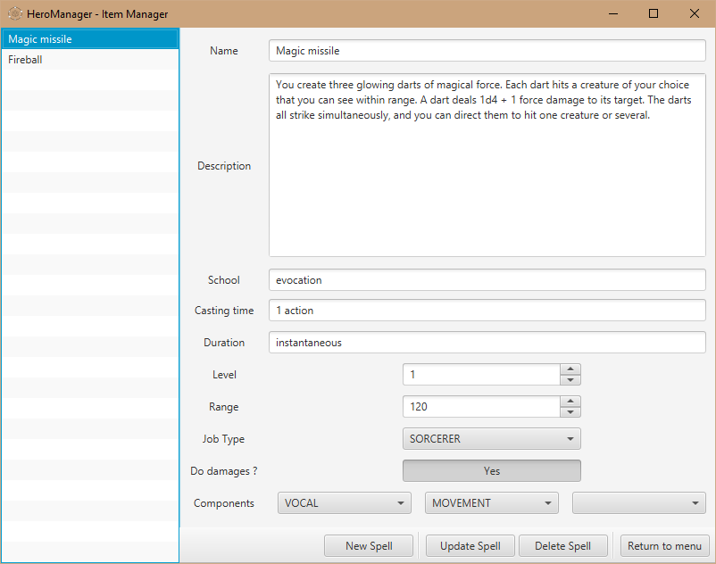

<div align="center">
  
  <h1>Hero Manager</h1>
  
</div>

---

## About

Hero Manager is an application designed to create and modify character's sheets for roleplay games based on Dungeons & Dragons, but not restricted to.

## Project Status

Development is now interrupted, the application is working in actual state but can be improved. (feel free to upgrade it! ^-^)

## Description

This application is a character sheet manager. It's purpose is to help the user to create one or multiple hero sheets and to modify it.

- Features:

    - Character creation

    - Character modification

    - Item/Spell creation

    - Item/Spell Modification

    - Dice roll


## Visuals

###Menu


### Character sheet


### Item Manager


### Spell Manager


## Possible improvements

- Allow users to play online by connecting to one of the user's network (game master) allowing him to modify connected user's Character sheets.

- Change interface theme to make it more D&D alike

- Multi-languages option


## Contributing

Pull requests are welcome.

Please make sure to create/update appropriated tests

## Authors

- SIBIAK Aymeric · [GitHub](https://github.com/ASibiak)

- Airels · [GitHub](https://github.com/Airels)

- NICOLAI Guillaume · [GitHub](https://github.com/Grosflan)


## Librairies

- JavaFX :
    - [Getting Started with JavaFX](https://openjfx.io/openjfx-docs/ "https://openjfx.io/openjfx-docs/")
    - [Getting Started with JavaFX: Hello World, JavaFX Style | JavaFX 2 Tutorials and Documentation](https://docs.oracle.com/javafx/2/get_started/hello_world.htm "https://docs.oracle.com/javafx/2/get_started/hello_world.htm")
- JsonSimple:
    - [JsonObject (Java(TM) EE 7 Specification APIs)](https://docs.oracle.com/javaee/7/api/javax/json/JsonObject.html "https://docs.oracle.com/javaee/7/api/javax/json/JsonObject.html")
    - [JsonArray (Java(TM) EE 7 Specification APIs)](https://docs.oracle.com/javaee/7/api/javax/json/JsonArray.html "https://docs.oracle.com/javaee/7/api/javax/json/JsonArray.html")

### Libraries for tests :

- OpenJFX Monocle:

    - https://wiki.openjdk.java.net/display/OpenJFX/Monocle
- JUnit:

    - [Overview (JUnit 5.7.2 API)](https://junit.org/junit5/docs/current/api/ "https://junit.org/junit5/docs/current/api/")

## Technologies
- IDE: IntelliJ IDEA
- Gradle

## How to compile into fat jar ?
Please open project with IntelliJ IDEA, and build configured artifact.

It will generate a jar with JavaFX dependencies, directly runnable with usual command :

```console
foo@bar:~$ java -jar HeroManager.jar
```

## Licence

This product is licensed under [Apache Licence 2.0](https://www.apache.org/licenses/LICENSE-2.0)